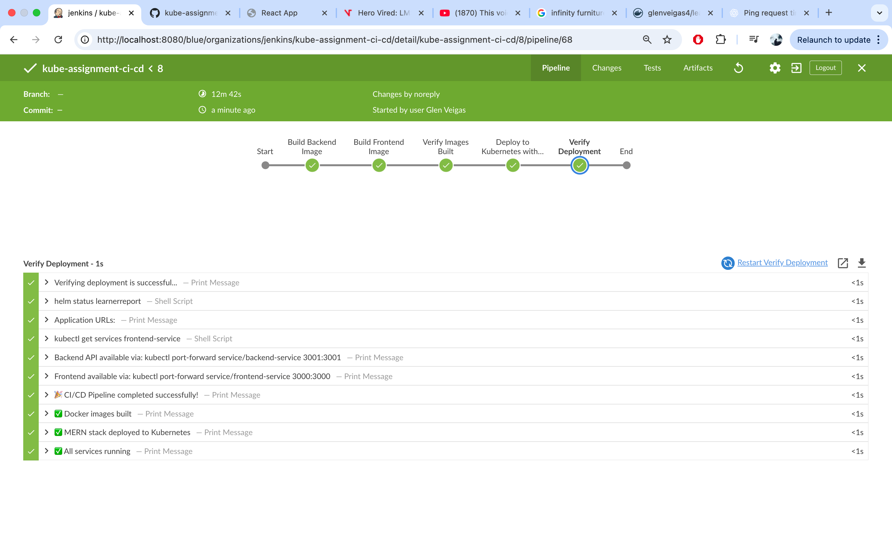
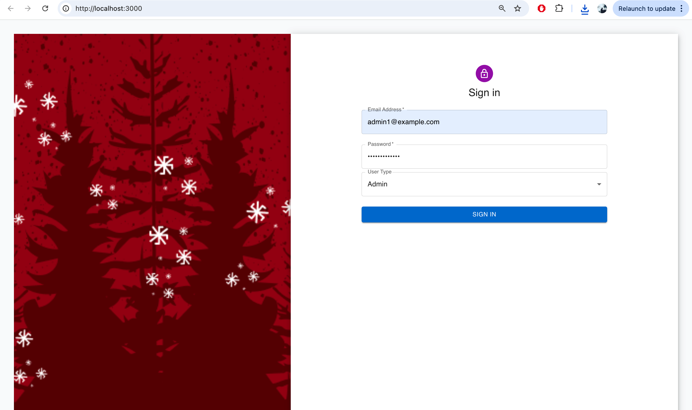

## End-to-End CI/CD Runbook (Docker → Docker Hub → Kubernetes → Helm → Jenkins)

Place your Jenkins screenshot at `docs/images/jenkins-success.png` and it will render below.



---

### 1) Prerequisites
- Docker Desktop (or Docker Engine) running
- kubectl configured (minikube/kind/cluster)
- Helm v3
- Git + GitHub repo access
- Jenkins LTS (Docker or local install)

Optional (for local-image deploy when registry is flaky):
- Set `.Values.backend.imagePullPolicy` and `.Values.frontend.imagePullPolicy` to `Never` in `helm-chart/values.yaml` (already configured in this repo)

---

### 2) Dockerfiles (already in repo)

Backend: `learnerReportCS_backend/Dockerfile`
```dockerfile
# syntax=docker/dockerfile:1.4
FROM node:16

WORKDIR /usr/src/app

# Install deps with clean, reproducible installs
COPY package*.json ./
RUN npm ci --legacy-peer-deps --prefer-offline --no-audit --no-fund

# Bundle app source
COPY . .

EXPOSE 3001
CMD ["node", "index.js"]
```

Frontend: `learnerReportCS_frontend/Dockerfile`
```dockerfile
# syntax=docker/dockerfile:1.4
FROM node:16

WORKDIR /usr/src/app

# Only copy lockfiles first to leverage layer cache
COPY package*.json ./

# Faster, reproducible installs and avoid peer hell
RUN npm ci --legacy-peer-deps --prefer-offline --no-audit --no-fund

# copy app source
COPY . .

EXPOSE 3000
CMD ["npm","start"]
```

---

### 3) Build images
```bash
# From repo root
# Backend
docker build -t glenveigas4/learnerreport-backend:latest learnerReportCS_backend

# Frontend
docker build -t glenveigas4/learnerreport-frontend:latest learnerReportCS_frontend

# Verify
docker images | grep learnerreport
```

---

### 4) Push to Docker Hub (when reachable)
```bash
docker login -u glenveigas4
# Push
docker push glenveigas4/learnerreport-backend:latest
docker push glenveigas4/learnerreport-frontend:latest
```
If Docker Hub is temporarily unreachable, deploy using local images with Helm (next section). The Helm values in this repo already set `imagePullPolicy: Never` for local-cluster testing.

---

### 5) Kubernetes deploy (manifests)
```bash
# Apply raw manifests (optional)
kubectl apply -f k8s/

# Check
kubectl get pods
kubectl get svc
```

---

### 6) Helm chart deploy (recommended)
```bash
# Validate chart
helm lint helm-chart

# Install/upgrade
helm upgrade --install learnerreport helm-chart

# Inspect
helm status learnerreport
kubectl get pods
kubectl get svc
```

If using local images, ensure your cluster can see Docker Desktop images (Docker Desktop Kubernetes usually can). For kind/minikube you may need to load images into the cluster explicitly.

---

### 7) Jenkins CI/CD

Jenkinsfile (root `Jenkinsfile`) stages:
- Build Backend Image
- Build Frontend Image
- Verify Images Built
- Deploy to Kubernetes with Helm
- Verify Deployment

Setup steps:
1. Run Jenkins (e.g., in Docker):
   ```bash
docker run -d --name jenkins -p 8080:8080 -p 50000:50000 \
  -v jenkins_home:/var/jenkins_home \
  -v /var/run/docker.sock:/var/run/docker.sock \
  -v $(pwd):/workspace \
  --user root jenkins/jenkins:lts
   ```
2. Install recommended plugins; restart
3. Create a Pipeline job pointing to your GitHub repo (`Jenkinsfile` at repo root)
4. (If you want pushes to Docker Hub) add Jenkins Credentials: ID `dockerhub-creds` with your Docker Hub username + Access Token
5. Build the job

Your pipeline should show stages green (see screenshot above). If Docker Hub is flaky, the pipeline still deploys via local images.

---

### 8) Access the app
```bash
# Port-forward locally
kubectl port-forward service/frontend-service 3000:3000
kubectl port-forward service/backend-service 3001:3001
```
Open http://localhost:3000

---

### 9) Cleanup
```bash
helm uninstall learnerreport || true
kubectl delete -f k8s/ || true
# Optional: remove images
# docker rmi glenveigas4/learnerreport-backend:latest
# docker rmi glenveigas4/learnerreport-frontend:latest
```

---

### 10) Notes
- This repo includes `.dockerignore` files to keep contexts small
- Helm values point frontend to backend service: `REACT_APP_API_BASE_URL: http://backend-service:3001`
- MongoDB runs in-cluster with a PVC; default storage: 1Gi
- For GitOps submissions, commit everything and push to GitHub, then attach your Jenkins screenshot at `docs/images/jenkins-success.png` 

## Quick Run

### Helm (recommended)
```bash
# From project root
helm upgrade --install learnerreport helm-chart

# Wait for pods
kubectl rollout status deploy/backend --timeout=120s
kubectl rollout status deploy/frontend --timeout=180s

# Access locally (two terminals)
kubectl port-forward service/backend-service 3001:3001
kubectl port-forward service/frontend-service 3000:3000
```
Open http://localhost:3000

### Docker only
```bash
# MongoDB
docker run -d --name mongodb -p 27017:27017 mongo:latest

# Backend
docker run -d --name learnerreport-backend \
  -e PORT=3001 \
  -e ATLAS_URI="mongodb://host.docker.internal:27017/learner_reportDB" \
  -e HASH_KEY=thisIsMyHashKey \
  -e JWT_SECRET_KEY=thisIsMyJwtSecretKey \
  -p 3001:3001 glenveigas4/learnerreport-backend:latest

# Frontend
docker run -d --name learnerreport-frontend \
  -e REACT_APP_API_BASE_URL="http://localhost:3001" \
  -p 3000:3000 glenveigas4/learnerreport-frontend:latest
```

### Local (Node/npm)
```bash
# MongoDB
docker run -d --name mongodb -p 27017:27017 mongo:latest

# Backend
cd learnerReportCS_backend
npm ci
export PORT=3001 ATLAS_URI="mongodb://localhost:27017/learner_reportDB" HASH_KEY=thisIsMyHashKey JWT_SECRET_KEY=thisIsMyJwtSecretKey
npm start

# Frontend (new terminal)
cd learnerReportCS_frontend
npm ci
export REACT_APP_API_BASE_URL="http://localhost:3001"
npm start
```

## Application Screenshot


 